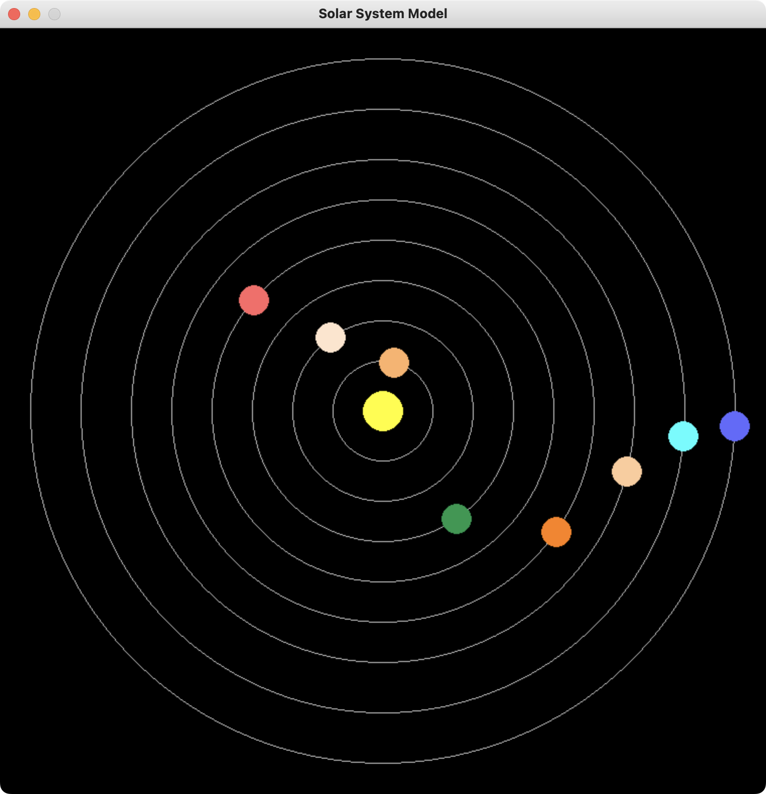

# Simple Model of the Solar System 

The project is a pygame simple one-window application and is an approximate visualization of how the planets of the Solar System move relative to each other. The result looks like this: 



+ Press the space key to pause.
+ Press the 2 key to double the speed.
+ Press the 5 key to decrease the speed by the 50% of the default.
+ Press the 1 key to reduce the speed by the 10% of the default.
+ Press the 0 key to reset the speed to default.

## Running the code

To run the visualization, start `main.py` file. As the program works on the basics of pygame, it is required. 

### Terminal

First, locate to the directory using `cd` (change directory) command. Optionally, create virtual environment. Secondly, install pygame, if it's not installed. 

Finally, run the following command:

```
python main.py
```

The program starts pygame window.

### Other ways

Open the project folder in any code editor that supports Python; (optionally) start the virtual environmentm; install the requirements; run the `main.py` file from the code editor interface. 

## What's inside 

```
data/
  - colors.json 
  - info.json
```

`colors.json` contains the colors of the planets. Change its values (RGB) to redecorate the app. 

`info.json` is the data file that is not recommended to be changed. 

`create_objects.py` is the code that gathers data from json and creates the Solar System components - the Sun and the planets. 

`main.py` is the main file of the project. It initialized the pygame and has all the processes. 